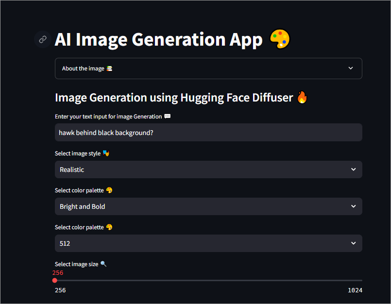
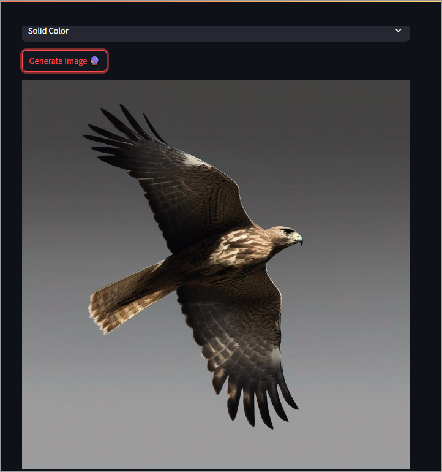
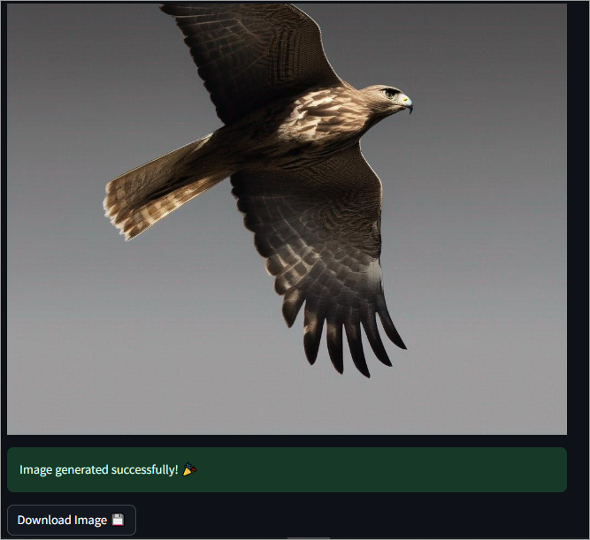

Here's an updated version with a bit more creativity and emojis:

# **🎨 AI Image Generation App 🤩**

## **What's the Magic? 🧙‍♂️**

This is a Streamlit app that uses Hugging Face's Stable Diffusion XL model to generate images from text prompts. Simply input your text, select your desired style, color palette, image size, and background, and the app will generate an image for you! 📸 It's like having your own personal artist at your fingertips! 🎭

## **Features Galore! 🎉**

- **Text-to-Image Generation**: Enter a text prompt and the app will generate an image based on your input. It's like magic, but with code! ✨
- **Customizable**: Choose from various styles, color palettes, image sizes, and backgrounds to create a unique image that's all you! 🎨
- **Real-time Generation**: The app generates images in real-time, so you can see your creation come to life! 🔥 It's like watching a painter at work, but faster! 🕒
- **Downloadable**: Download your generated image as a PNG file and share it with the world! 📱

## **How to Use (It's Easy, We Promise!)**

1. Input your text prompt in the text box. Be creative! 📝
2. Select your desired style, color palette, image size, and background from the dropdown menus. Get fancy! 💃
3. Click the "Generate Image" button. The magic happens here! ✨
4. Wait for the image to generate (this may take a few seconds). Be patient, it's worth it! 🕰️
5. If successful, the image will be displayed below. You can also download it as a PNG file. Share it with your friends! 🤩

## **Technical Details (For the Nerds!)**

- The app uses Hugging Face's Stable Diffusion XL model for image generation. It's like a superpower for your computer! 💻
- The model is accessed through the Hugging Face API. We're grateful for their hard work! 🙏
- The app is built using Streamlit, a Python library for creating interactive web apps. It's like building with blocks, but with code! 🧮

## **License (The Fine Print)**

This app is licensed under the MIT License. See [LICENSE](LICENSE) for details. Don't worry, it's not as boring as it sounds! 😊

## **Contributing (Join the Fun!)**

Contributions are welcome! If you'd like to contribute to this project, please fork the repo and submit a pull request. We'd love to have you on board! 🚀

## **Acknowledgments (Thanks, Guys!)**

- Hugging Face for providing the Stable Diffusion XL model and API. You guys are the best! 🙌
- Streamlit for creating an amazing library for building interactive web apps. You make it easy to build cool stuff! 😊

## **Screenshots (Coming Soon!)**

